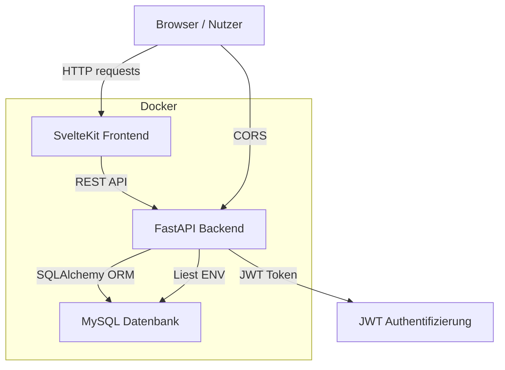

# Architekturdiagramm
*Antoniaa*

Diese Datei beschreibt die Architektur von Smart Kitchen und die wichtigsten Komponenten.

## Komponenten

- `frontend/`
  - SvelteKit UI
  - Stellt Seiten für Login, Registrierung, Dashboard, Rezept-Erstellung und Rezeptdetails bereit
  - Nutzt `frontend/src/lib/api.ts` für API-Aufrufe zum Backend

- `backend/`
  - FastAPI-Server
  - Authentifizierung mittels JWT (`backend/auth.py`)
  - Datenbankzugriff über SQLAlchemy (`backend/database.py`)
  - API-Endpunkte in `backend/main.py`

- `db`
  - MySQL-Datenbank für persistente Speicherung
  - Speichert Benutzer, Rezepte, Zutaten, Schritte, Bewertungen und Tags

## Datenfluss

1. Benutzer lädt die SvelteKit-App im Browser.
2. Das Frontend ruft das Backend über REST-API-Endpunkte auf.
3. Geschützte Requests verwenden einen JWT-Token im `Authorization`-Header.
4. Das Backend validiert den Token und liest/schreibt Daten in die MySQL-Datenbank.
5. Das Backend antwortet mit JSON, das das Frontend rendert.
