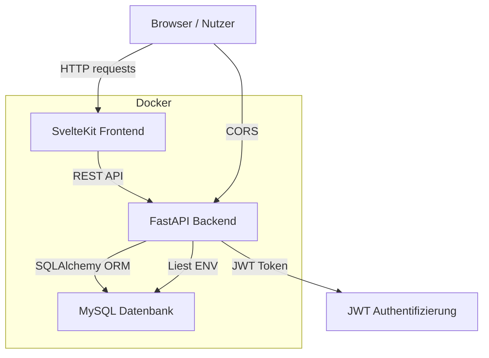

# Architekturdiagramm

Diese Datei beschreibt die Architektur von Smart Kitchen und die wichtigsten Komponenten.

## Komponenten

- `frontend/`
  - SvelteKit UI
  - Enthält Routen für Login, Registrierung, Rezeptliste, neues Rezept, Rezeptdetails und Einkaufsliste
  - Nutzt `frontend/src/lib/api.ts` für API-Aufrufe zum Backend

- `backend/`
  - FastAPI-Server
  - Authentifizierung mittels JWT (`backend/auth.py`)
  - Datenbankzugriff über SQLAlchemy (`backend/database.py`)
  - API-Endpunkte in `backend/main.py`
  - Pydantic-Schemas in `backend/schemas.py`
  - Tabellen- und ORM-Modelle in `backend/models.py`

- `db`
  - MySQL-Datenbank für persistente Speicherung
  - Speichert Benutzer, Rezepte, Zutaten, Schritte, Bewertungen, Tags, Favoriten und Einkaufslisten

## Datenfluss

1. Der Browser lädt die SvelteKit-Anwendung.
2. Das Frontend rendert die UI und ruft REST-API-Endpunkte des Backends auf.
3. Bei geschützten Aktionen verwendet das Frontend einen JWT im `Authorization: Bearer <token>`-Header.
4. Das Backend prüft das Token, validiert Daten und liest/schreibt Informationen in die MySQL-Datenbank.
5. Das Backend liefert JSON-Antworten, die das Frontend darstellt.

## Wichtige API-Komponenten

- `/auth/register` – Benutzerregistrierung
- `/token` – Login und Token-Ausgabe
- `/my-profile` – aktuelles Profil
- `/recipes`, `/recipes/{id}`, `/recipes/mine`, `/recipes/favorites` – Rezeptverwaltung
- `/recipes/{id}/favorite` – Favorit hinzufügen/entfernen
- `/recipes/{id}/ratings` – Rezeptbewertung
- `/shopping-list` – Einkaufsliste
- `/shopping-list/items` – manuelles Item
- `/shopping-list/from-recipe/{id}` – Zutaten aus Rezept übernehmen

## Docker-Setup

- `docker-compose.yml` startet drei Dienste:
  - `db` (MySQL)
  - `backend` (FastAPI)
  - `frontend` (SvelteKit)

- `backend/` und `frontend/` sind in Docker als Volumes eingebunden, damit Änderungen im Projekt sofort wirksam werden.
